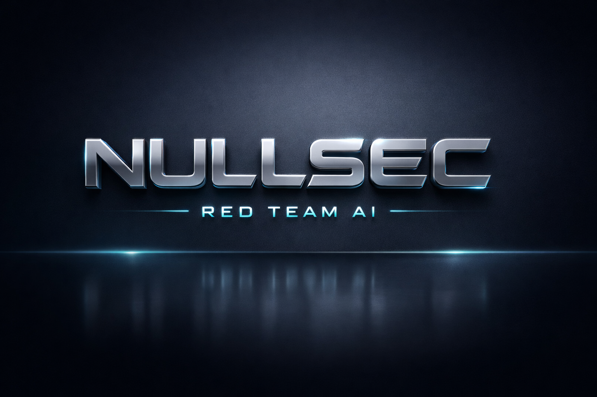
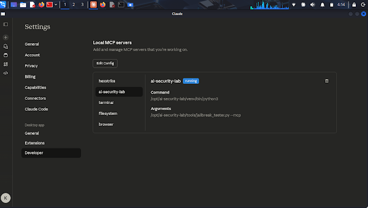
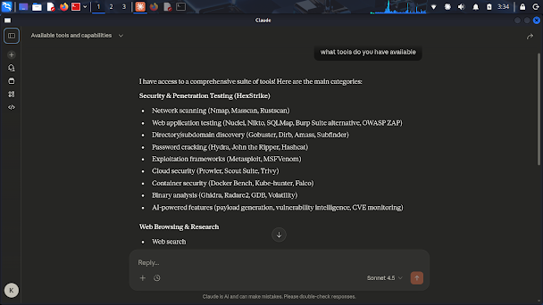
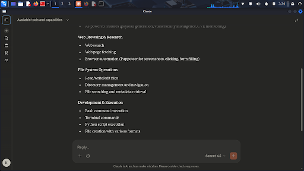

<div align="center">
  
  <p><strong>The Ultimate AI-Powered Red Team Platform: Claude Desktop + HexStrike AI + AI Security Lab</strong></p>
  <p>A single, self-contained installer for the most advanced AI-driven penetration testing and security research environment.</p>
  
  <p>
    
    
    
    
  </p>
</div>

---

## 🌟 Features: Unlocking AI-Driven Penetration Testing

**NULLSEC Red Team AI** is a comprehensive, all-in-one solution that transforms your Linux machine into a state-of-the-art AI-driven security lab. It flawlessly integrates the best tools in the industry to give your AI agent (Claude) full system access and a massive arsenal of offensive capabilities.

| Component | Description | Key Capabilities |
| :--- | :--- | :--- |
| **Claude Desktop** | The AI's command center, installed and configured for Linux. | User Interface, Multi-Model Support, Secure Local Access. |
| **HexStrike AI** | Advanced Model Context Protocol (MCP) server. | **150+** Real-World Security Tools (Nmap, SQLMap, Metasploit, etc.), Multi-Agent Architecture. |
| **AI Security Lab** | Your custom LLM vulnerability testing framework. | **50+** Jailbreak Techniques, Prompt Injection Scanning, Adversarial Testing (Garak, PyRIT). |
| **MCP Orchestration** | Pre-configured `claude_desktop_config.json`. | **Full System Access** (Terminal, Filesystem, Browser Automation) for Claude. |
| **Guardian Tool** | Embedded diagnostic and self-healing utility. | Auto-Fixes Common Errors, GitHub Issue Search for Unknown Problems, Integrity Checks. |

---

## 📸 Visual Demonstration: The AI in Action

These screenshots demonstrate the seamless integration and powerful capabilities available to the AI agent within the Claude Desktop environment.

| **AI Security Lab Configuration** | **Offensive Toolset Overview** |
| :---: | :---: |
|  |  |
| *Verification of the AI Security Lab and HexStrike MCP servers running locally.* | *A partial list of the 150+ tools available to the AI agent, categorized for easy access.* |

<div align="center">
  
  <p><em>The full range of capabilities, including File System Operations and Development & Execution, giving the AI complete control over the lab environment.</em></p>
</div>

---

## 🚀 Quick Start Installation (The God Mode Command)

This script is designed to be run on a fresh Debian/Ubuntu-based system (e.g., Kali Linux, Ubuntu Desktop). It handles all dependencies, configurations, and service setups automatically.

1.  **Download the Installer:**
    ```bash
    wget https://raw.githubusercontent.com/Panda1847/NullSec-RedTeam-AI/main/install.sh
    ```

2.  **Run the Script (Requires `sudo`):**
    ```bash
    chmod +x install.sh
    sudo ./install.sh
    ```

The script will take a significant amount of time to complete as it installs large packages like Metasploit and compiles Go-based tools. Please be patient.

---

## 🛠️ Post-Installation Steps

1.  **Launch Claude Desktop:** Find "Claude Desktop" in your application menu and launch it.
2.  **Log In:** Complete the login process for your Claude account.
3.  **Verify MCP Servers:** Go to Claude's settings and check the Model Context Protocol (MCP) servers. You should see:
    *   `hexstrike` (Green/Active)
    *   `ai-security-lab` (Green/Active)
    *   `terminal` (Green/Active)
    *   `filesystem` (Green/Active)
    *   `browser` (Green/Active)
4.  **Start Red Teaming:** You can now instruct Claude to perform complex, multi-stage attacks against your target VM using its newly acquired tools.

---

## 🛡️ Failsafe & Diagnostics (The Guardian Tool)

The **Guardian Tool** is embedded within the installer and deployed to `/usr/local/bin/guardian`. It provides self-healing capabilities:

| Command | Description |
| :--- | :--- |
| `sudo guardian` | Runs a full system integrity check and reports the health status of all components. |
| `sudo guardian "error message"` | Attempts to diagnose and fix a specific error message. If the issue is unknown, it automatically searches GitHub for potential solutions. |

---

## ⚙️ Configuration Details

| Component | Location | Notes |
| :--- | :--- | :--- |
| **Claude Config** | `~/.config/Claude/claude_desktop_config.json` | Contains all pre-configured MCP server endpoints. |
| **HexStrike AI** | `/opt/hexstrike-ai` | Source code and virtual environment. |
| **AI Security Lab** | `/opt/ai-security-lab` | Source code and virtual environment. |
| **Lab Workspace** | `~/NullSec_RedTeam_Lab` | Claude's default working directory for file operations. |
| **HexStrike Service** | `/etc/systemd/system/hexstrike.service` | Ensures HexStrike runs persistently in the background. |

---

## 🤝 Contributing

We welcome contributions to improve the toolset, add more failsafes, or enhance the documentation. Please feel free to fork the repository and submit a Pull Request.

---

## ⚠️ Disclaimer

This tool is designed exclusively for **authorized security research, penetration testing, and educational purposes** in a controlled, isolated lab environment. The user is solely responsible for any misuse. The developers are not responsible for any illegal or unauthorized activities.

---
<div align="center">
  <p>A project by Panda1847</p>
</div>
