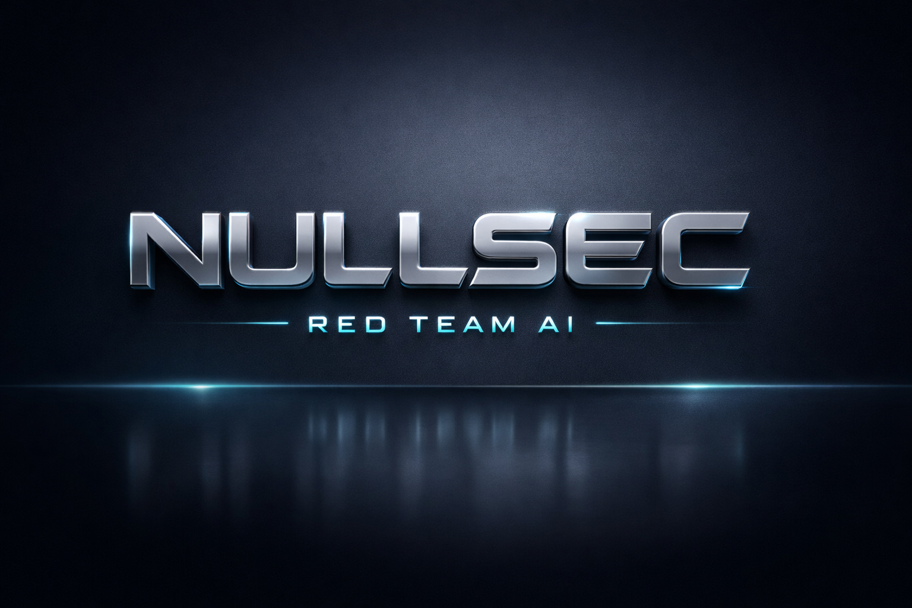

# NullSec Red Team AI: Ultimate Offensive Security Toolkit (v2.0)

[](https://opensource.org/licenses/MIT)
[](https://github.com/Panda1847/NullSec-RedTeam-AI/stargazers)

<div align="center">
  
  <p><strong>The Ultimate AI-Powered Red Team Platform: Claude Desktop + HexStrike AI + AI Security Lab</strong></p>
</div>

---

## 🌟 Features: Unlocking AI-Driven Penetration Testing

**NullSec Red Team AI** is a comprehensive, all-in-one solution that transforms your Linux machine into a state-of-the-art AI-driven security lab. It integrates the best tools in the industry to give your AI agent (Claude) full system access and a massive arsenal of offensive capabilities.

| Component | Description | Key Capabilities |
| :--- | :--- | :--- |
| **Claude Desktop** | The AI's command center, installed and configured for Linux. | User Interface, Multi-Model Support, Secure Local Access. |
| **HexStrike AI** | Advanced Model Context Protocol (MCP) server. | **150+** Real-World Security Tools, Multi-Agent Architecture. |
| **AI Security Lab** | Your custom LLM vulnerability testing framework. | **50+** Jailbreak Techniques, Prompt Injection Scanning. |
| **Self-Healing** | Advanced crash prevention and auto-repair logic. | **Guardian Module** monitors and fixes issues in real-time. |
| **Visual UI** | Professional terminal experience. | **BlackArch Style** Pacman loading animations. |

---

## 🚀 Quick Start Installation

This script handles all dependencies, configurations, and service setups automatically.

1.  **Download the Installer:**
    ```bash
    wget https://raw.githubusercontent.com/Panda1847/NullSec-RedTeam-AI/main/install.sh
    ```

2.  **Run the Script (Requires `sudo`):**
    ```bash
    chmod +x install.sh
    sudo ./install.sh
    ```

---

## 🛡️ Failsafe & Diagnostics (The Guardian Tool)

The **Guardian Tool** is embedded within the installer and deployed to `/usr/local/bin/guardian`. It provides self-healing capabilities:

| Command | Description |
| :--- | :--- |
| `sudo guardian` | Runs a full system integrity check with Pacman animations. |
| `sudo guardian "error message"` | Attempts to diagnose and fix a specific error message automatically. |

---

## 🎮 Visual Experience

Experience a professional red team environment with our custom terminal animations. The BlackArch-style Pacman loading sequence provides visual feedback during long-running security operations.

---

## ⚠️ Disclaimer

This tool is designed exclusively for **authorized security research, penetration testing, and educational purposes**. The user is solely responsible for any misuse.

---
<div align="center">
  <p>A project by Panda1847</p>
</div>
