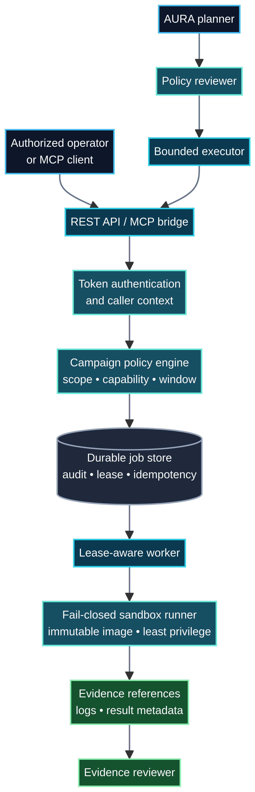
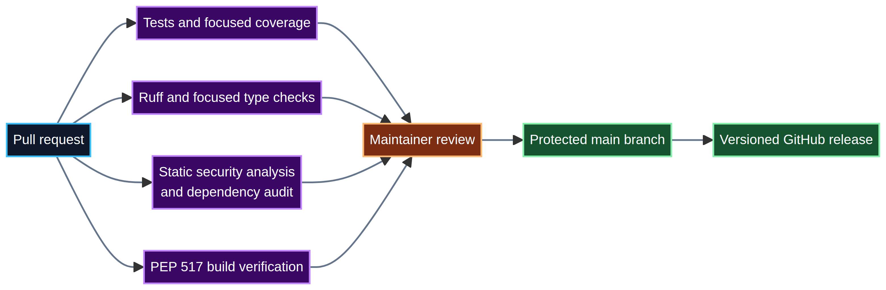

# NullSec-RedTeam-AI

[](https://github.com/Panda1847/NullSec-RedTeam-AI/actions/workflows/ci.yml)
[](LICENSE)
[](pyproject.toml)
[](CHANGELOG.md)

> **Authorization-first, MCP-governed security execution for explicitly approved environments.**

NullSec-RedTeam-AI is a single-host control plane for governed security-tool workflows. It records a campaign’s approved scope, actor context, policy decision, durable job lifecycle, audit trail, and evidence reference **before** a worker is allowed to execute a job. Its default posture is **sandbox-required and fail-closed**: a required sandbox never degrades to host execution.

> **Use only with explicit written authorization.** This project is early-stage security software, not an autonomous red-team system, a substitute for an engagement agreement, or a multi-tenant service. Run it in isolated test environments or on assets you are expressly authorized to assess.



## Why NullSec?

| Principle | What it means in practice |
|---|---|
| **Authorization before execution** | Every job is evaluated against a campaign, caller identity, target scope, capability tier, time window, policy decision, idempotency key, and trace identifier. |
| **Containment that fails closed** | Sandbox-required work needs an immutable image, an available container runtime, least-privilege configuration, and a bounded workspace. Missing controls fail the job rather than executing locally. |
| **Auditable operations** | SQLite-backed jobs retain lifecycle events, leases, cancellation state, actor and campaign linkage, policy context, and evidence metadata. |
| **Bounded AI collaboration** | AURA separates planning, policy review, execution permission, and evidence review. A planner cannot directly call a runner. |
| **Truthful AI security testing** | The AI Security Lab labels simulation output as `not_evaluated`; it does not present synthetic output as a provider finding. |

## Architecture at a Glance

A user or MCP client reaches the transport layer only after authentication and caller-context construction. The campaign policy engine decides whether a typed request is in scope. The durable job store coordinates leases and audit events; a lease-aware worker can then request a least-privilege sandbox run. AURA remains above the execution boundary, with a separate evidence-review stage.

The source-controlled Mermaid diagram is available at [`docs/assets/control-plane-architecture.mmd`](docs/assets/control-plane-architecture.mmd). Read the architecture rationale in [ADR-001](docs/architecture/ADR-001-authorization-first-execution.md).

## Quick Start for Safe Local Development

The development workflow uses mocks and simulated fixtures; it does **not** install, download, or execute security tools.

```bash
git clone https://github.com/Panda1847/NullSec-RedTeam-AI.git
cd NullSec-RedTeam-AI
python3 -m venv .venv
source .venv/bin/activate
python -m pip install --upgrade pip
python -m pip install -e '.[dev]'

pytest
ruff check .
```

For local API-development work, use project-local state, a non-production token, and loopback binding only.

```bash
mkdir -p .nullsec/logs .nullsec/jobs
export NULLSEC_LOG_DIR="$PWD/.nullsec/logs"
export NULLSEC_JOB_DIR="$PWD/.nullsec/jobs"
export API_TOKEN="local-development-token"
export NULLSEC_LOCAL_ACTOR_ID="local-operator"
export NULLSEC_LOCAL_ACTOR_ROLES="operator"

hexstrike-server --host 127.0.0.1 --port 8888
```

The service rejects non-loopback binding unless `NULLSEC_ALLOW_NON_LOOPBACK=true` is explicitly set. Treat that setting as a deployment change requiring an authenticated reverse proxy and an approved network policy.

## Safe Campaign Flow

A campaign records authorization and scope. The following loopback-only example creates a campaign record; it does **not** run a tool.

```bash
curl --request POST http://127.0.0.1:8888/api/campaigns \
  --header "Authorization: Bearer $API_TOKEN" \
  --header 'Content-Type: application/json' \
  --data '{
    "campaign_id": "local-demo-001",
    "allowed_targets": ["127.0.0.0/8"],
    "allowed_capabilities": ["passive"],
    "starts_at": "2026-08-18T09:00:00+00:00",
    "ends_at": "2026-08-18T17:00:00+00:00"
  }'
```

Job submission requires that campaign, a supported capability tier, and an idempotency key. With the default `sandbox_required` mode, a job remains safe to queue but fails closed at execution unless an operator has supplied a reviewed immutable image and rootless runner configuration.

```bash
curl --request POST http://127.0.0.1:8888/api/tools/execute \
  --header "Authorization: Bearer $API_TOKEN" \
  --header 'Content-Type: application/json' \
  --header 'X-Trace-Id: local-demo-trace-001' \
  --data '{
    "tool": "nmap",
    "target": "127.0.0.1",
    "options": "-sV",
    "campaign_id": "local-demo-001",
    "capability": "passive",
    "idempotency_key": "local-demo-request-001"
  }'
```

Do not place bearer tokens in shell history, source control, screenshots, or CI logs.

## AI Security Lab

The AI Security Lab distinguishes a **simulation** from an actual provider evaluation. Its default output has `mode: simulation` and `status: not_evaluated`; it does not claim a model is vulnerable, resistant, or scored. Provider evaluation stays unavailable until an organization supplies a consented adapter, a versioned dataset, protected credentials, evidence storage, and a scoring method.

```bash
ai-lab --list
ai-lab --model consented-test-model --technique PROMPT_INJECTION --mode simulation
```

The project deliberately does not generate bypass payloads. Any provider-backed assessment should use a reviewed, versioned dataset in an isolated environment.

## Quality Gates

Every contribution should satisfy test, code-quality, security, packaging, and review expectations before release.



The public workflow covers tests with focused coverage, Ruff linting, focused type checking, static security analysis, dependency auditing, and PEP 517 package builds. The quality-gate diagram source is [`docs/assets/quality-gates.mmd`](docs/assets/quality-gates.mmd).

## Project Status and Roadmap

| Area | Current state | Next meaningful milestone |
|---|---|---|
| Identity | Local single-host actor adapter | Deployment-specific OAuth/OIDC or equivalent identity adapter |
| Policy | Campaign scope, capability, window, and target checks | Persistent policy repository and approval workflow |
| Execution | Local lease-aware worker with fail-closed sandbox profile | Reviewed rootless runtime profile and signed immutable runner image |
| AURA | Typed, bounded workflow state machine | Persisted sessions, durable evidence links, and policy-governed provider adapters |
| Evidence | Job audit events and evidence references | Managed evidence storage with retention and integrity controls |

See [ROADMAP.md](ROADMAP.md) for the maintained implementation sequence and [IMPLEMENTATION_SUMMARY.md](IMPLEMENTATION_SUMMARY.md) for the 7.1 modernization record.

## Documentation

| Document | Use it for |
|---|---|
| [RESPONSIBLE_USE.md](RESPONSIBLE_USE.md) | Authorization, containment, and operator responsibilities |
| [SECURITY.md](SECURITY.md) | Private vulnerability reporting and response process |
| [CONTRIBUTING.md](CONTRIBUTING.md) | Development setup, review standards, and safe adapter requirements |
| [CODE_OF_CONDUCT.md](CODE_OF_CONDUCT.md) | Community participation standards |
| [docs/runbooks/deployment.md](docs/runbooks/deployment.md) | Single-host deployment and rollback workflow |
| [docs/runbooks/runner-hardening.md](docs/runbooks/runner-hardening.md) | Rootless runner, image, and containment review |
| [docs/runbooks/evidence-retention.md](docs/runbooks/evidence-retention.md) | Evidence provenance, retention, and incident preservation |
| [CHANGELOG.md](CHANGELOG.md) | Versioned changes and release notes |

## Contributing

Contributions must preserve the authorization-first posture. New integrations need a typed request model, risk tier, capability scope, safe execution profile, deterministic tests, and an evidence parser or documented limitation. Do not add arbitrary shell execution, unbounded option strings, live-target tests, credentials, target inventories, or generated scan artifacts.

Open a design issue or propose an architecture decision record before broad changes. Review [CONTRIBUTING.md](CONTRIBUTING.md) first, and use [SECURITY.md](SECURITY.md) instead of public issues for vulnerability reports.

## License

This project is licensed under the [MIT License](LICENSE). The license does not grant authorization to assess a system. Operators remain responsible for applicable law, contracts, organizational policy, written authorization, and engagement constraints.
