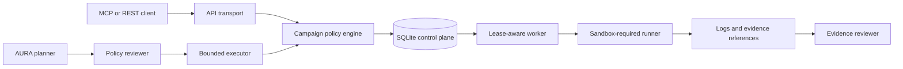

# NullSec-RedTeam-AI

**Authorization-first, MCP-governed security execution for explicitly approved environments.**

> **Early-stage security software:** This project is a single-host platform under active modernization. It is not an autonomous red-team system, a substitute for written authorization, or a supported multi-tenant service. Use it only in isolated test environments or on assets you are explicitly authorized to assess.

NullSec-RedTeam-AI provides a local control plane for submitting approved security-tool jobs through a REST API and an MCP bridge. It records campaign scope, caller context, policy decisions, durable job state, audit events, and evidence references before work is eligible for execution. Its default posture is **sandbox-required**; a required sandbox never falls back to local host execution.

## Current Status

| Area | Implemented in this worktree | Important limitation |
|---|---|---|
| Execution control plane | Campaign-scoped policy decisions, target scope checks, idempotency keys, audit events, SQLite-backed job lifecycle | The first identity adapter is a local operator configuration, not OAuth/OIDC or multi-tenancy |
| Worker reliability | Transactional leases, heartbeats, cancellation state, explicit terminal states, lease recovery | A single SQLite database is appropriate only for single-host operation |
| Containment | Immutable image requirement, non-root user, read-only root filesystem, dropped capabilities, resource limits, process-group cancellation | Operators must provide a rootless container runtime and a reviewed image digest |
| AURA workflow | Typed planner, policy-reviewer, executor, and evidence-reviewer state machine | It has no LLM provider adapter and cannot execute a tool directly |
| AI Security Lab | Versioned test-case metadata, transparent simulation records, provider-evaluator protocol | Simulations are **not** provider calls and produce no security findings |
| Project hygiene | License, responsible-use policy, contribution guide, security policy, issue/PR templates, CI configuration | Release artifacts and published version tags are still maintainership work |

## Safety Model

A job must have a campaign, a matching caller context, a target inside the campaign’s approved scope, an allowed capability tier, an idempotency key, a recorded policy decision, and a trace identifier. The worker accepts only two execution modes:

| Execution mode | Behavior |
|---|---|
| `sandbox_required` | The default. The worker requires an immutable container image digest and an available container runtime. If either is unavailable, the job fails closed and is not run on the host. |
| `development` | Disabled unless `NULLSEC_EXECUTION_MODE=development` is set. This exists only for local mocks and controlled development. It must not be used for engagement work. |

The sandbox runner rejects host networking and mutable image tags. It applies a non-root container user, read-only root filesystem, dropped Linux capabilities, `no-new-privileges`, process and resource limits, a bounded workspace mount, and process-group termination. Operators should run the container runtime rootlessly and keep its daemon interface unavailable to untrusted users.

Read [RESPONSIBLE_USE.md](RESPONSIBLE_USE.md) before configuring a runner. Report defects through [SECURITY.md](SECURITY.md), not a public issue.

## Architecture


```mermaid
flowchart LR
    Client[MCP or REST client] --> API[API transport]
    API --> Policy[Campaign policy engine]
    Policy --> Store[(SQLite control plane)]
    Store --> Worker[Lease-aware worker]
    Worker --> Runner[Sandbox-required runner]
    Runner --> Evidence[Logs and evidence references]

    Planner[AURA planner] --> Review[Policy reviewer]
    Review --> Executor[Bounded executor]
    Executor --> Policy
    Evidence --> EvidenceReview[Evidence reviewer]
```

The AURA layer is intentionally separated from execution. A planner can create a typed proposal, but cannot call a runner. A policy reviewer must approve every step. The executor receives one typed request only after approval, and an evidence reviewer closes the workflow after an evidence reference is recorded.

## Requirements

Use Python 3.10 or later. For runner-backed development, provide a locally reviewed OCI-compatible container runtime, a rootless deployment where possible, and a toolbox image pinned by digest. This repository does not install, download, or execute security tools as part of its automated test suite.

## Safe Local Development Setup

Create an isolated Python environment and install the declared development dependencies:

```bash
git clone https://github.com/Panda1847/NullSec-RedTeam-AI.git
cd NullSec-RedTeam-AI
python3 -m venv .venv
source .venv/bin/activate
python -m pip install --upgrade pip
python -m pip install -e '.[dev]'

# Safe validation: tests use mocks and simulated fixtures only.
pytest
ruff check .
```

For local API-development tests, use a project-local state directory and a non-production token. Do not expose this service outside loopback during development.

```bash
mkdir -p .nullsec/logs .nullsec/jobs
export NULLSEC_LOG_DIR="$PWD/.nullsec/logs"
export NULLSEC_JOB_DIR="$PWD/.nullsec/jobs"
export API_TOKEN="local-development-token"
export NULLSEC_LOCAL_ACTOR_ID="local-operator"
export NULLSEC_LOCAL_ACTOR_ROLES="operator"

hexstrike-server --host 127.0.0.1 --port 8888
```

The server refuses non-loopback binding unless `NULLSEC_ALLOW_NON_LOOPBACK=true` is explicitly set. That setting is appropriate only behind an approved authenticated reverse proxy and network policy.

## Campaign-Controlled API Flow

The following local-only example records a campaign. It does **not** execute a tool. Time values must include a timezone.

```bash
export API_TOKEN="local-development-token"

curl --request POST http://127.0.0.1:8888/api/campaigns \
  --header "Authorization: Bearer $API_TOKEN" \
  --header 'Content-Type: application/json' \
  --data '{
    "campaign_id": "local-demo-001",
    "allowed_targets": ["127.0.0.0/8"],
    "allowed_capabilities": ["passive"],
    "starts_at": "2026-08-17T09:00:00+00:00",
    "ends_at": "2026-08-17T17:00:00+00:00"
  }'
```

A job request requires that campaign, a capability tier, and an idempotency key. In the default `sandbox_required` mode, it will remain safe to queue but will fail closed at execution time until an operator supplies a reviewed immutable image and runner configuration.

```bash
curl --request POST http://127.0.0.1:8888/api/tools/execute \
  --header "Authorization: Bearer $API_TOKEN" \
  --header 'Content-Type: application/json' \
  --header 'X-Trace-Id: local-demo-trace-001' \
  --data '{
    "tool": "nmap",
    "target": "127.0.0.1",
    "options": "-sV",
    "campaign_id": "local-demo-001",
    "capability": "passive",
    "idempotency_key": "local-demo-request-001"
  }'
```

The public health endpoint returns only readiness. Authenticated API routes expose approved job information. Do not place bearer tokens in shell history, source control, screenshots, or CI logs.

## AI Security Lab

The AI Security Lab now separates **simulation** from **provider evaluation**. Its default output is a JSON record with `mode: simulation` and `status: not_evaluated`; it does not claim a model is vulnerable, resistant, or scored. Provider mode returns `configuration_required` until an organization supplies a consented provider adapter, versioned dataset, protected credentials, evidence storage, and a scoring method.

```bash
ai-lab --list
ai-lab --model consented-test-model --technique PROMPT_INJECTION --mode simulation
```

The project deliberately does not generate bypass payloads. Use a reviewed, versioned evaluation dataset in an isolated environment for any provider-backed assessment.

## Repository Guide

| Document | Purpose |
|---|---|
| [RESPONSIBLE_USE.md](RESPONSIBLE_USE.md) | Authorization, containment, and operator responsibilities |
| [SECURITY.md](SECURITY.md) | Private vulnerability reporting and response targets |
| [CONTRIBUTING.md](CONTRIBUTING.md) | Development setup, review standards, and safe adapter requirements |
| [CODE_OF_CONDUCT.md](CODE_OF_CONDUCT.md) | Community participation standards |
| [docs/UPGRADE_SCOPE.md](docs/UPGRADE_SCOPE.md) | Implemented modernization scope and exclusions |
| [docs/architecture/ADR-001-authorization-first-execution.md](docs/architecture/ADR-001-authorization-first-execution.md) | Rationale for the authorization-first control plane |
| [CHANGELOG.md](CHANGELOG.md) | Versioned change history |

## Contributing

Contributions must preserve the project’s authorization-first posture. New tool integrations require a typed request model, risk tier, required capability scope, safe execution profile, deterministic tests, and evidence parser or documented limitation. Do not add arbitrary shell command execution, unbounded option strings, live-target tests, credentials, target inventories, or generated scan artifacts.

See [CONTRIBUTING.md](CONTRIBUTING.md) for the full process. For broad changes, open a design issue or submit an architecture decision record before writing implementation code.

## License

This project is licensed under the [MIT License](LICENSE). The license does not grant authorization to assess a system. Operators remain responsible for written authorization, laws, contracts, organizational policy, and engagement constraints.
