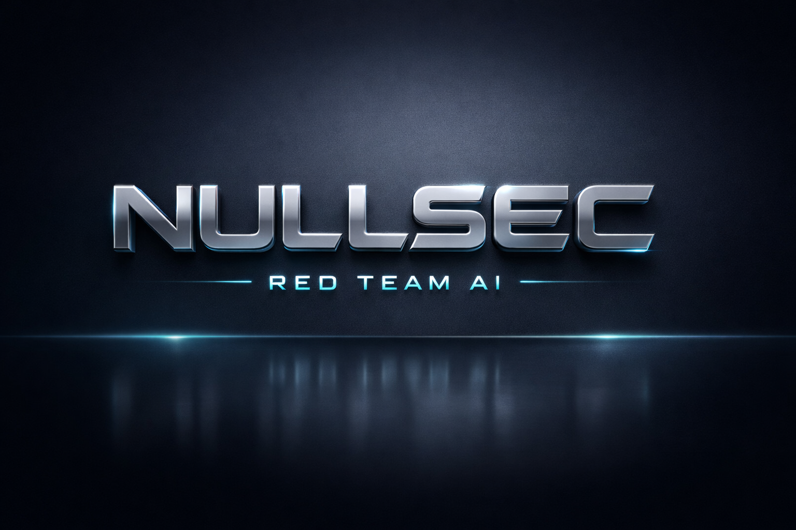
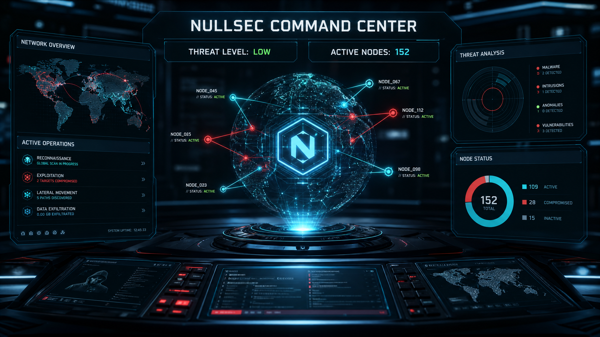

<p align="center">
  
</p>

<p align="center">
  
  
  
  
</p>

---

# NullSec Red Team AI

**NullSec Red Team AI** is an elite offensive security toolkit engineered for seamless integration with **Claude Desktop** via the **Model Context Protocol (MCP)**. It empowers security professionals with a unified, AI-driven interface to orchestrate over 150+ industry-standard penetration testing tools within a hardened, controlled environment.

## 🚀 Project Overview

This architecture bridges the gap between state-of-the-art Large Language Models and professional-grade security tooling. By granting AI agents direct yet governed access to a specialized security ecosystem, NullSec enables high-velocity workflows for reconnaissance, vulnerability research, and advanced exploitation simulations.

### 🛡️ Core Architecture

<p align="center">
  
</p>

| Component | Functionality |
| :--- | :--- |
| **HexStrike AI** | A high-performance Flask orchestration server managing 150+ offensive tools including Nmap, SQLMap, and Metasploit. |
| **AI Security Lab** | A sandbox environment dedicated to LLM jailbreak testing and automated model vulnerability scanning. |
| **Guardian Tool** | A self-healing diagnostic utility for system integrity verification and automated environment repair. |
| **MCP Bridge** | Native, low-latency integration for Claude Desktop to execute complex security workflows. |

---

## 🛠️ Installation & Deployment

The NullSec deployment process is fully automated and hardened, ensuring a consistent and secure setup across supported Linux distributions.

### Prerequisites

*   **OS:** Kali Linux (Recommended), Debian 12+, or Ubuntu 22.04+.
*   **Hardware:** 4GB+ RAM, 20GB+ Disk Space.
*   **Software:** Python 3.10+, Node.js 18+, Git.

### Automated Setup

```bash
# Clone the elite repository
git clone https://github.com/Panda1847/NullSec-RedTeam-AI.git
cd NullSec-RedTeam-AI

# Execute a dry-run to verify the environment
sudo ./install.sh --dry-run --full

# Perform a comprehensive installation
sudo ./install.sh --full
```

### Deployment Profiles

| Profile | Flag | Scope |
| :--- | :--- | :--- |
| **Core** | `--core` | Base installation of 150+ security tools (apt/pip). |
| **Desktop** | `--desktop` | Optimized Claude Desktop for Linux installation. |
| **MCP** | `--mcp` | HexStrike MCP server configuration for Claude. |
| **Lab** | `--lab` | Deployment of AI Security Lab payloads and testbeds. |
| **Full** | `--full` | End-to-end deployment of all NullSec components. |

---

## 🔒 Security & Governance

We maintain the highest standards of operational security (OpSec) and environment isolation.

<p align="center">
  
</p>

*   **Workspace Isolation:** AI interactions are strictly confined to the `~/NullSec_RedTeam_Lab` directory by default.
*   **Opt-in Elevation:** Elevated system access is disabled by default and requires the explicit `--elevated` flag.
*   **Audit Logging:** Detailed installation and execution logs are maintained at `/var/log/nullsec/` with restricted access.
*   **Dependency Pinning:** All internal and external packages are version-pinned to prevent supply chain attacks and ensure reproducibility.

### Guardian Diagnostic System

The `guardian` utility (located at `/usr/local/bin/guardian`) provides a read-only-by-default diagnostic layer for the entire toolkit.

*   **Integrity Check:** `guardian --check`
*   **Issue Diagnosis:** `guardian "describe the anomaly"`
*   **Guided Remediation:** `guardian --repair "error signature"` *(Requires manual confirmation)*

---

<p align="center">
  Designed for Professionals. Built for the Future of AI Security.
</p>
